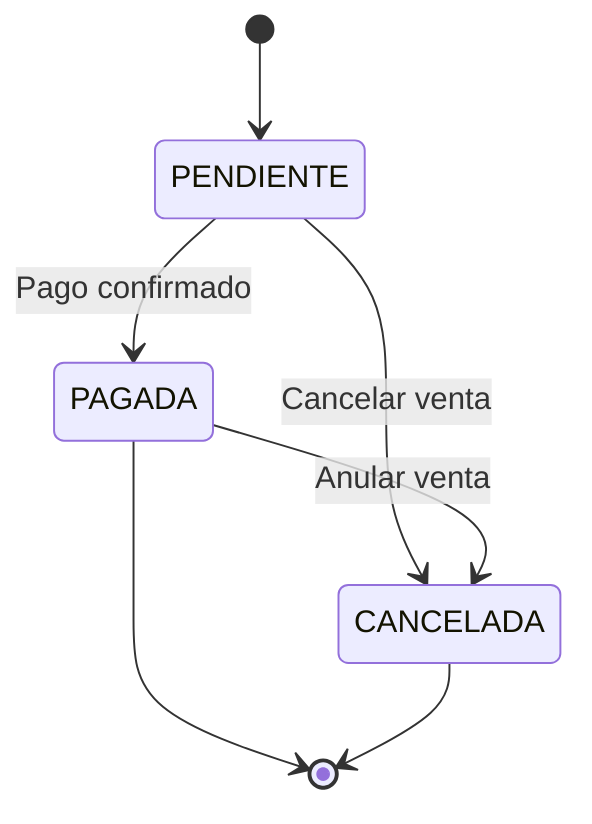
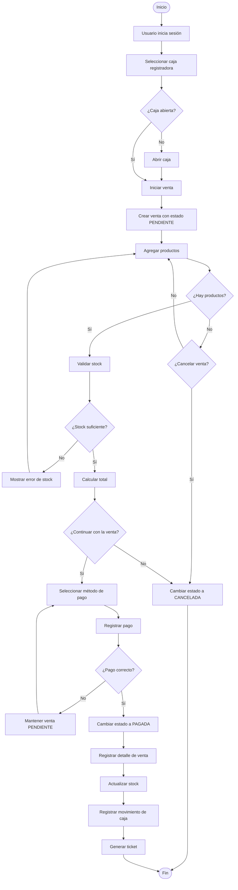
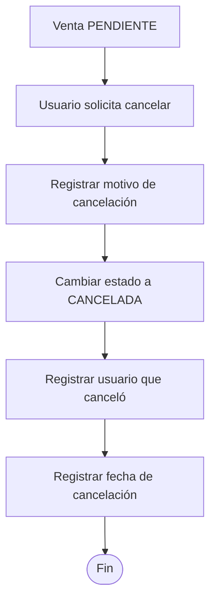
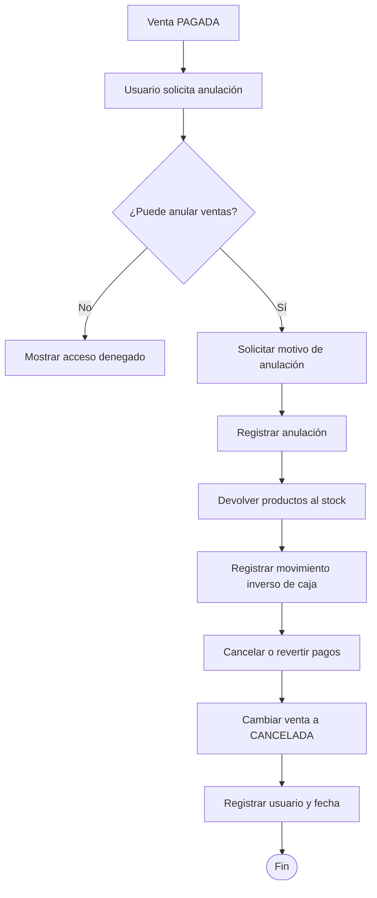

# Estados de la venta

Una venta puede tener los siguientes estados:

| Estado      | Descripción                                                           |
| ----------- | --------------------------------------------------------------------- |
| `PENDIENTE` | La venta fue iniciada, pero todavía no se ha completado el pago.      |
| `PAGADA`    | El pago fue registrado correctamente y la venta fue finalizada.       |
| `CANCELADA` | La venta fue anulada y ya no debe considerarse como una venta válida. |

## Flujo de estados



---

# Flujo completo de venta



---

# Cancelación de una venta

Una venta puede cancelarse mientras está pendiente o después de haber sido pagada.

## Cancelar venta pendiente



Cuando una venta está `PENDIENTE`, normalmente todavía no se modificó el stock ni se registraron movimientos definitivos de caja.

---

## Anular una venta pagada

Si una venta ya está `PAGADA`, la cancelación necesita más operaciones.



---

# Reglas de cancelación

- Una venta no debe eliminarse de la base de datos.
- Una venta cancelada conserva su información para auditoría.
- Debe registrarse quién canceló la venta.
- Debe registrarse cuándo fue cancelada.
- Debe registrarse el motivo de cancelación.
- Una venta `CANCELADA` no debe contarse en los ingresos del día.
- Una venta `CANCELADA` no debe contarse dentro de las ventas efectivas.
- Si una venta `PAGADA` es anulada, el stock debe restaurarse.
- Si afectó la caja, debe crearse un movimiento inverso.
- No se debe borrar el movimiento original.
- Los pagos asociados deben quedar anulados o revertidos según corresponda.

---

# Campos recomendados para `sales`

```text
sales
--------------------------------
id
cash_register_opening_id
user_id
status
subtotal
total
created_at
paid_at

cancelled_at
cancelled_by
cancellation_reason
```

El campo:

```text
status
```

podría aceptar:

```text
PENDING
PAID
CANCELLED
```

o en español:

```text
PENDIENTE
PAGADA
CANCELADA
```

Para código recomiendo mantener los valores en inglés:

```typescript
enum SaleStatus {
  PENDING = 'PENDING',
  PAID = 'PAID',
  CANCELLED = 'CANCELLED',
}
```

---

# Ejemplo del ciclo de vida

```text
Venta #125

10:20
PENDING
↓
Se agregan 3 productos
↓
Total S/ 58.00
↓
Pago con Yape
↓
10:23
PAID
↓
Se genera ticket
```

Si posteriormente se anula:

```text
Venta #125

PAID
↓
Usuario solicita anulación
↓
Motivo:
"Cliente solicitó cancelar la compra"
↓
Stock restaurado
↓
Movimiento de caja revertido
↓
CANCELLED
```

La venta `#125` sigue existiendo en la base de datos; simplemente queda registrada como cancelada.
