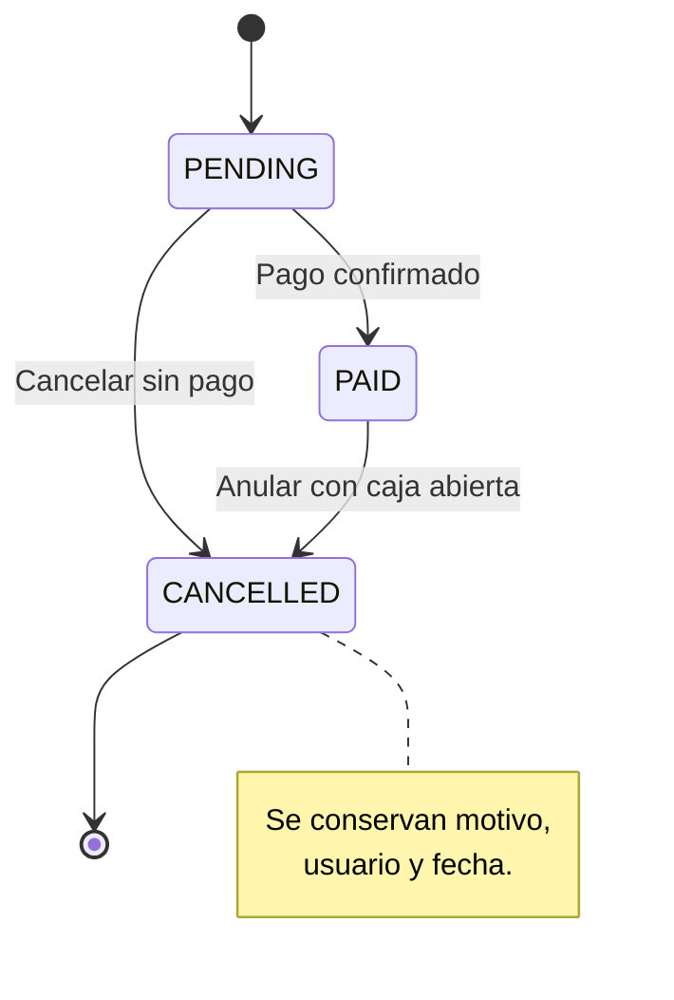
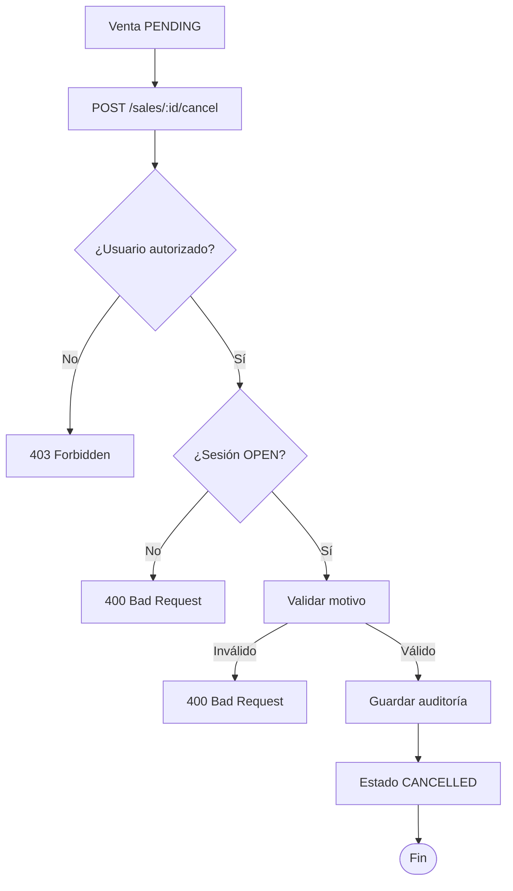
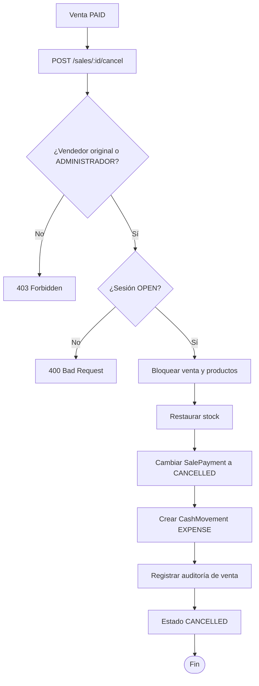

# Cancelar y anular ventas

> Guía operativa para `POST /sales/:id/cancel` según el SPEC 17.

El endpoint usa la misma transición persistida, `CANCELLED`, para dos situaciones:

- **Cancelar** una venta `PENDING`, antes de recibir el pago.
- **Anular** una venta `PAID`, después de haber descontado stock y registrado el pago.

La venta no se elimina. Sus detalles, información de pago y datos de auditoría permanecen disponibles para consultas y cierres de caja.

## 1. Requisitos

Antes de cancelar o anular, el sistema valida:

| Requisito      | Regla                                                     |
| -------------- | --------------------------------------------------------- |
| Autenticación  | El usuario debe tener rol `ADMINISTRADOR` o `TRABAJADOR`. |
| Autorización   | Puede hacerlo el vendedor original o un `ADMINISTRADOR`.  |
| Sesión de caja | `cashOpening` debe seguir en estado `OPEN`.               |
| Estado         | La venta debe ser `PENDING` o `PAID`.                     |
| Motivo         | Texto obligatorio de 1 a 500 caracteres.                  |
| Idempotencia   | Una venta `CANCELLED` no puede cancelarse otra vez.       |

Una venta vinculada a una sesión cerrada no puede cancelarse, aunque el usuario sea administrador. El cierre de caja es el límite operativo de esta acción.

## 2. Transiciones permitidas



No se permite:

- Cancelar una venta ya `CANCELLED`.
- Anular una venta `PAID` después del cierre de su sesión.
- Volver de `CANCELLED` a `PENDING` o `PAID`.
- Eliminar la venta para ocultar su historial.

## 3. Endpoint

```http
POST /sales/:id/cancel
Authorization: Bearer <token>
Content-Type: application/json
```

```json
{
  "cancellationReason": "Cliente desistió de la compra"
}
```

El motivo se almacena en la venta. En caso de una venta pagada, también se incorpora al motivo del movimiento inverso de caja:

```text
Anulación de venta #42: Cliente desistió de la compra
```

## 4. Cancelar una venta pendiente

Una venta `PENDING` todavía no tiene `SalePayment` y no ha reducido el stock.



La transacción solo actualiza la venta:

| Registro                  | Resultado                                     |
| ------------------------- | --------------------------------------------- |
| `sale.status`             | `CANCELLED`.                                  |
| `sale.cancelledAt`        | Fecha y hora de la cancelación.               |
| `sale.cancelledBy`        | Persona autenticada que ejecutó la operación. |
| `sale.cancellationReason` | Motivo enviado por el usuario.                |
| `sale_payment`            | No se crea ni se modifica.                    |
| `product.stock`           | No cambia.                                    |
| `cash_movement`           | No se crea.                                   |

Respuesta resumida:

```json
{
  "id": 42,
  "status": "CANCELLED",
  "payment": null,
  "cancelledById": 5,
  "cancellationReason": "Cliente desistió de la compra"
}
```

## 5. Anular una venta pagada

Una venta `PAID` ya descontó unidades y su pago contribuye al importe efectivo de la sesión. Por eso la anulación debe revertir sus efectos dentro de una única transacción.



La operación realiza estos cambios:

1. Bloquea la venta y los productos para evitar modificaciones concurrentes.
2. Suma al stock la cantidad de cada detalle.
3. Conserva el mismo `SalePayment` y cambia su estado a `CANCELLED`.
4. Crea un movimiento inverso de caja:

```ts
{
  opening: sale.cashOpening,
  type: CashMovementType.EXPENSE,
  amount: sale.totalAmount,
  reason: `Anulación de venta #${sale.id}: ${cancellationReason}`,
  createdBy: cancelledBy,
}
```

5. Guarda `cancelledAt`, `cancelledBy` y `cancellationReason`.
6. Cambia `sale.status` a `CANCELLED`.

Si falla cualquiera de estos pasos, la transacción hace rollback: no queda stock restaurado sin auditoría, pago cancelado sin egreso ni venta parcialmente anulada.

## 6. Efecto en caja

La anulación no borra el ingreso original ni elimina la venta.

| Elemento           | Antes de anular      | Después de anular                      |
| ------------------ | -------------------- | -------------------------------------- |
| Venta              | `PAID`               | `CANCELLED`                            |
| Pago               | `PAID`               | `CANCELLED`                            |
| Stock              | Descontado           | Restaurado                             |
| Ingreso efectivo   | Incluido por el pago | Excluido porque el pago está cancelado |
| Movimiento inverso | No existe            | `EXPENSE` por `sale.totalAmount`       |

Durante el cierre, `SalePayment` solo aporta importes cuando su estado es `PAID`. El movimiento `EXPENSE` conserva la trazabilidad de la reversión en la sesión.

## 7. Auditoría persistida

Una venta cancelada conserva como mínimo:

| Campo                | Uso                                               |
| -------------------- | ------------------------------------------------- |
| `status`             | Estado final `CANCELLED`.                         |
| `cancelledAt`        | Momento de la operación.                          |
| `cancelledBy`        | Persona que realizó la cancelación.               |
| `cancellationReason` | Justificación proporcionada.                      |
| `details`            | Productos, cantidades y precios de la venta.      |
| `payment`            | Pago original, con estado `CANCELLED` si existía. |
| `cashOpening`        | Sesión donde ocurrió la venta y su reversión.     |

Con estos datos se puede explicar qué ocurrió sin borrar ni sobrescribir el historial original.

## 8. Permisos y errores

| Situación                                 | Resultado                                       |
| ----------------------------------------- | ----------------------------------------------- |
| Vendedor original cancela su propia venta | Permitido si la sesión está abierta.            |
| `ADMINISTRADOR` cancela cualquier venta   | Permitido si la sesión está abierta.            |
| Otro `TRABAJADOR` intenta cancelarla      | `403 Forbidden`.                                |
| Venta inexistente                         | `404 Not Found`.                                |
| Sesión inexistente                        | `404 Not Found`.                                |
| Sesión cerrada                            | `400 Bad Request`.                              |
| Venta ya `CANCELLED`                      | `400 Bad Request`.                              |
| Motivo vacío                              | `400 Bad Request`.                              |
| Motivo mayor de 500 caracteres            | `400 Bad Request`.                              |
| Venta `PAID` sin pago asociado            | `400 Bad Request`; no se completa la anulación. |

## 9. Ejemplo de ciclo de vida

```text
Venta #42
  PENDING
    └── Se agregan productos y se calcula S/ 27.50
  PAID
    └── Se confirma un pago de S/ 27.50
    └── Se descuentan 2 unidades del stock
  CANCELLED
    └── Se restaura el stock
    └── El pago pasa a CANCELLED
    └── Se registra un EXPENSE de S/ 27.50
    └── Se conserva el motivo y el usuario responsable
```

## 10. Fuera de alcance

Este flujo no contempla:

- Anulación después del cierre de caja.
- Devoluciones parciales o cambios de productos.
- Pagos mixtos o múltiples pagos por venta.
- Ventas fiadas o cobros posteriores.
- Tickets, impresión o notas de crédito.
- Reapertura de sesiones cerradas.
