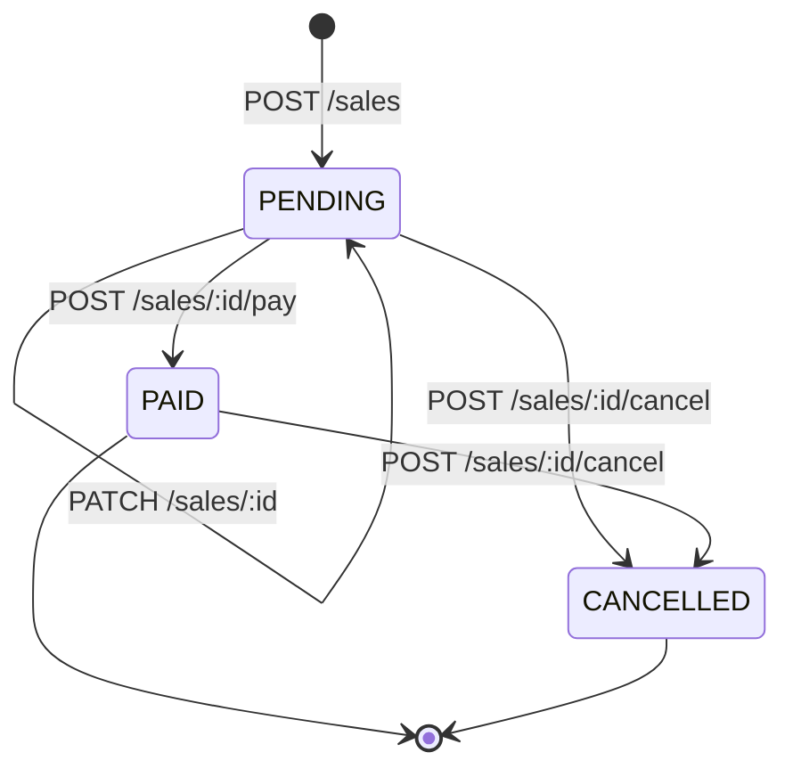
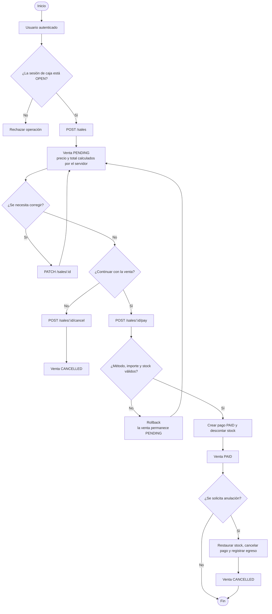

# Flujo de ventas

> Documentación funcional del **SPEC 17: flujo de ventas pendientes, pago y cancelación**.

Una venta no se cobra al crearla. El sistema separa la preparación de la venta de la confirmación del pago:

1. `POST /sales` crea una venta `PENDING`.
2. `PATCH /sales/:id` permite corregirla mientras siga pendiente.
3. `POST /sales/:id/pay` confirma el pago y cambia la venta a `PAID`.
4. `POST /sales/:id/cancel` la conserva como `CANCELLED`, con su auditoría.

Esta separación evita descontar stock o registrar un pago antes de que el importe haya sido confirmado.

## 1. Estados de la venta

| Estado      | Significado                                                 | ¿Se puede editar? | ¿Se puede pagar? |        ¿Se puede cancelar?        |
| ----------- | ----------------------------------------------------------- | :---------------: | :--------------: | :-------------------------------: |
| `PENDING`   | La venta existe, tiene detalles y aún no tiene pago.        |        Sí         |        Sí        |                Sí                 |
| `PAID`      | El importe exacto fue cobrado y el stock fue descontado.    |        No         |        No        | Sí, mientras la caja siga abierta |
| `CANCELLED` | La venta fue cancelada y conserva sus datos para auditoría. |        No         |        No        |                No                 |



No existen transiciones de regreso: una venta pagada no vuelve a pendiente y una venta cancelada no se reactiva.

## 2. Reglas principales

### Caja

- La sesión indicada por `cashOpeningId` debe existir y estar `OPEN` para crear, editar, pagar o cancelar una venta.
- Una sesión cerrada bloquea cualquier operación que cambie la venta.
- La venta conserva la sesión de caja a la que quedó asociada.

### Productos, precios y stock

- La venta debe tener al menos un detalle.
- Cada cantidad debe ser un entero positivo.
- El servidor obtiene el precio vigente desde `Product.price`; el cliente no puede imponer el precio.
- El descuento es un monto fijo y no puede superar el subtotal.
- Al crear o editar se valida que haya stock suficiente, pero el stock **no se descuenta**.
- Al pagar se vuelve a validar el stock dentro de la transacción y recién entonces se descuenta.
- El precio y el subtotal quedan guardados como instantánea en `SaleDetail`.

### Pago

- Solo se puede pagar una venta `PENDING`.
- El método de pago debe existir y estar activo.
- El importe enviado debe coincidir exactamente con `totalAmount`.
- Una venta tiene como máximo un `SalePayment`.
- Una venta pendiente devuelve `payment: null`.
- El cierre de caja suma únicamente pagos con estado `PAID`.

### Cancelación

- El motivo es obligatorio y debe tener entre 1 y 500 caracteres.
- El vendedor original o un usuario con rol `ADMINISTRADOR` puede cancelar.
- Una venta `PENDING` no modifica stock, pago ni caja al cancelarse.
- Una venta `PAID` restaura stock, cambia su pago a `CANCELLED` y crea un egreso inverso en la misma sesión.
- La venta y el movimiento original no se eliminan.

## 3. Flujo completo



Todas las operaciones compuestas de pago y anulación se ejecutan dentro de una transacción. Si una validación o una escritura falla, se revierten los cambios de esa operación.

## 4. Endpoints

Todos los endpoints requieren autenticación Bearer y uno de estos roles: `ADMINISTRADOR` o `TRABAJADOR`.

### Crear una venta pendiente

```http
POST /sales
```

```json
{
  "cashOpeningId": 3,
  "customerId": 12,
  "discount": 2.5,
  "details": [
    {
      "productId": 7,
      "quantity": 2
    }
  ]
}
```

El servidor busca el cliente, el vendedor autenticado y los productos. Calcula cada subtotal y guarda la venta con estado `PENDING`. No crea `SalePayment`, no modifica `Product.stock` y no crea un movimiento de caja.

Respuesta resumida:

```json
{
  "id": 42,
  "status": "PENDING",
  "customerId": 12,
  "sellerId": 5,
  "cashOpeningId": 3,
  "discount": 2.5,
  "totalAmount": 27.5,
  "paidAt": null,
  "cancelledAt": null,
  "cancelledById": null,
  "cancellationReason": null,
  "payment": null,
  "details": [
    {
      "id": 101,
      "productId": 7,
      "productName": "Tornillo",
      "quantity": 2,
      "unitPrice": 15,
      "subtotal": 30
    }
  ]
}
```

### Editar una venta pendiente

```http
PATCH /sales/:id
```

Todos los campos son opcionales. Los campos omitidos conservan su valor actual.

```json
{
  "customerId": 14,
  "discount": 3,
  "details": [
    {
      "productId": 7,
      "quantity": 3
    }
  ]
}
```

La operación solo acepta ventas `PENDING` y sesiones `OPEN`. Al reemplazar los detalles, el servidor vuelve a consultar los precios actuales, valida el stock y recalcula `discount`, los subtotales y `totalAmount`. No descuenta stock ni crea un pago.

Una venta `PAID` o `CANCELLED` no puede editarse.

### Pagar una venta

```http
POST /sales/:id/pay
```

```json
{
  "paymentMethodId": 1,
  "amount": 27.5
}
```

El servidor bloquea la venta y los productos, valida que la sesión siga abierta, verifica el método activo y compara el importe con el total final. Si todo es válido, en una sola transacción:

1. Descuenta el stock.
2. Crea un único `SalePayment` con estado `PAID`.
3. Cambia la venta a `PAID`.
4. Registra `paidAt`.

Si el importe no coincide o el stock es insuficiente, la venta continúa `PENDING` y no se persiste ningún cambio parcial.

### Cancelar o anular una venta

```http
POST /sales/:id/cancel
```

```json
{
  "cancellationReason": "Cliente desistió de la compra"
}
```

El mismo endpoint cubre dos casos:

- `PENDING`: registra la cancelación sin tocar stock, pago ni caja.
- `PAID`: restaura el stock, cambia el pago a `CANCELLED` y registra un `CashMovement` de tipo `EXPENSE` por el total de la venta.

En ambos casos se registran `cancelledAt`, `cancelledBy` y `cancellationReason`. Para más detalle, consulta [cancelar-venta.md](./cancelar-venta.md).

### Consultar ventas

```http
GET /sales?page=1&limit=20&status=PAID&cashOpeningId=3&startDate=2026-09-01&endDate=2026-09-30T23:59:59.999Z
```

Filtros disponibles:

| Parámetro       | Tipo     | Descripción                                                          |
| --------------- | -------- | -------------------------------------------------------------------- |
| `page`          | entero   | Página, inicia en `1`. Valor predeterminado: `1`.                    |
| `limit`         | entero   | Elementos por página, entre `1` y `100`. Valor predeterminado: `20`. |
| `status`        | enum     | `PENDING`, `PAID` o `CANCELLED`.                                     |
| `cashOpeningId` | entero   | Sesión de caja asociada.                                             |
| `sellerId`      | entero   | Vendedor. Solo es aplicable al `ADMINISTRADOR`.                      |
| `startDate`     | ISO 8601 | Fecha mínima de `saleDate`.                                          |
| `endDate`       | ISO 8601 | Fecha máxima de `saleDate`.                                          |

Un `TRABAJADOR` solo recibe sus propias ventas, aunque intente enviar otro `sellerId`. Un `ADMINISTRADOR` puede consultar todas o filtrar por vendedor.

Respuesta:

```json
{
  "data": [],
  "total": 0,
  "page": 1,
  "limit": 20,
  "lastPage": 0
}
```

Para consultar una venta individual:

```http
GET /sales/:id
```

La respuesta incluye cliente, vendedor, sesión de caja, detalles, estado, fechas de pago o cancelación, datos de auditoría y el pago opcional.

## 5. Respuesta de una venta

Los importes se devuelven como números, aunque se persisten con dos decimales en la base de datos.

| Campo                        | Descripción                                            |
| ---------------------------- | ------------------------------------------------------ |
| `id`                         | Identificador de la venta.                             |
| `saleDate`                   | Fecha de creación.                                     |
| `customerId`, `customerName` | Cliente asociado.                                      |
| `sellerId`, `sellerName`     | Vendedor que creó la venta.                            |
| `cashOpeningId`              | Sesión de caja vinculada.                              |
| `discount`                   | Descuento global como monto fijo.                      |
| `totalAmount`                | Subtotal menos descuento.                              |
| `status`                     | Estado actual de la venta.                             |
| `paidAt`                     | Fecha de pago o `null`.                                |
| `cancelledAt`                | Fecha de cancelación o `null`.                         |
| `cancelledById`              | Persona que canceló o `null`.                          |
| `cancellationReason`         | Motivo registrado o `null`.                            |
| `payment`                    | Pago único o `null` mientras la venta esté pendiente.  |
| `details`                    | Productos, cantidades, precios y subtotales guardados. |

Ejemplo de pago incluido:

```json
{
  "payment": {
    "paymentMethodId": 1,
    "paymentMethodName": "Efectivo",
    "amount": 27.5,
    "status": "PAID"
  }
}
```

En una venta pagada y luego anulada, el mismo objeto conserva el pago, pero su estado pasa a `CANCELLED`.

## 6. Caja y cálculos efectivos

Los cierres de caja consideran:

- Solo `SalePayment` con `status = PAID`.
- Los movimientos manuales de caja según su tipo `INCOME` o `EXPENSE`.
- El egreso creado al anular una venta pagada.

Por eso una venta `CANCELLED` y su pago cancelado no vuelven a sumar ingresos efectivos. El pago original no se elimina y el movimiento inverso tampoco reemplaza ni borra registros anteriores.

## 7. Errores habituales

| Situación                                             | Resultado esperado                               |
| ----------------------------------------------------- | ------------------------------------------------ |
| Sesión de caja inexistente                            | `404 Not Found`.                                 |
| Sesión de caja cerrada                                | `400 Bad Request`.                               |
| Producto o persona inexistente                        | `404 Not Found`.                                 |
| Venta `PAID` o `CANCELLED` editada                    | `400 Bad Request`.                               |
| Método de pago inexistente                            | `404 Not Found`.                                 |
| Método de pago inactivo                               | `400 Bad Request`.                               |
| Importe diferente del total                           | `400 Bad Request`.                               |
| Stock insuficiente al pagar                           | `400 Bad Request`; la venta permanece `PENDING`. |
| Trabajador consultando otra venta                     | `403 Forbidden`.                                 |
| Trabajador cancelando una venta ajena                 | `403 Forbidden`.                                 |
| Motivo de cancelación vacío o mayor de 500 caracteres | `400 Bad Request`.                               |

## 8. Alcance del flujo

Incluye ventas pendientes, edición antes del pago, un único pago, cancelación auditada, restauración de stock, filtros y visibilidad por rol.

No incluye:

- Ventas fiadas, saldos pendientes o cobros posteriores.
- Pagos mixtos o más de un pago por venta.
- Tickets, impresión o envío de comprobantes.
- Anulación después del cierre de caja.
- Devoluciones parciales, cambios de productos o notas de crédito.
- Reapertura de sesiones cerradas.
- Reportes financieros consolidados o cambios en el frontend.
