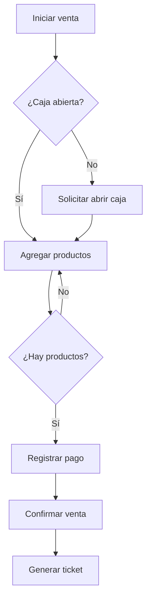

# Flujo de ventas

## Reglas

- El usuario debe tener una caja abierta.
- Una venta debe tener al menos un producto.
- El stock debe ser suficiente.
- El pago debe cubrir el total de la venta.

## Diagrama

Mapa de Proceso - Punto de Venta

Flujo principal para registrar una venta y generar un ticket.

1. Flujo principal de venta

flowchart TD
A([Inicio]) --> B[Usuario inicia sesión]
B --> C[Selecciona caja registradora]

    C --> D{¿Hay una caja abierta?}

    D -- No --> E["Mostrar mensaje: Debe abrir una caja para realizar ventas"]
    E --> F[Abrir caja registradora]
    F --> G[Agregar productos a la venta]

    D -- Sí --> G

    G --> H{¿Hay productos en la venta?}

    H -- No --> I["Mostrar mensaje: Debe agregar al menos un producto"]
    I --> G

    H -- Sí --> J["Seleccionar método de pago (Efectivo, Yape, Tarjeta, etc.)"]
    J --> K[Registrar pago]
    K --> L[Generar ticket]
    L --> M[Finalizar venta]
    M --> N([Fin])

2. Gestión de productos

Este flujo es opcional y se utiliza cuando el producto todavía no existe en el sistema.

flowchart TD
A([Inicio]) --> B[Registrar nuevo producto]
B --> C["Definir precio, stock y categoría"]
C --> D[Producto disponible para la venta]
D --> E([Fin])

La gestión de productos se conecta con el proceso de Agregar productos a la venta.

3. Flujo completo con gestión de productos

flowchart TD
START([Inicio]) --> LOGIN[Usuario inicia sesión]
LOGIN --> SELECT_CASH[Selecciona caja registradora]

    SELECT_CASH --> CASH_OPEN{¿Hay una caja abierta?}

    CASH_OPEN -- No --> CASH_MSG["Mostrar mensaje: Debe abrir una caja para realizar ventas"]
    CASH_MSG --> OPEN_CASH[Abrir caja registradora]
    OPEN_CASH --> ADD_PRODUCTS

    CASH_OPEN -- Sí --> ADD_PRODUCTS[Agregar productos a la venta]

    PRODUCT_EXISTS{¿El producto existe?}
    ADD_PRODUCTS --> PRODUCT_EXISTS

    PRODUCT_EXISTS -- No --> NEW_PRODUCT[Registrar nuevo producto]
    NEW_PRODUCT --> PRODUCT_DATA["Definir precio, stock y categoría"]
    PRODUCT_DATA --> PRODUCT_READY[Producto disponible para la venta]
    PRODUCT_READY --> ADD_PRODUCTS

    PRODUCT_EXISTS -- Sí --> HAS_PRODUCTS{¿Hay productos en la venta?}

    HAS_PRODUCTS -- No --> PRODUCT_MSG["Mostrar mensaje: Debe agregar al menos un producto"]
    PRODUCT_MSG --> ADD_PRODUCTS

    HAS_PRODUCTS -- Sí --> PAYMENT_METHOD["Seleccionar método de pago (Efectivo, Yape, Tarjeta, etc.)"]

    PAYMENT_METHOD --> REGISTER_PAYMENT[Registrar pago]
    REGISTER_PAYMENT --> GENERATE_TICKET[Generar ticket]
    GENERATE_TICKET --> FINISH_SALE[Finalizar venta]
    FINISH_SALE --> END([Fin])

4. Flujo recomendado para implementación

Además del flujo visual original, para la implementación del sistema conviene incluir las operaciones internas que ocurren al confirmar una venta.

flowchart TD
A[Seleccionar caja registradora] --> B{¿Caja abierta?}

    B -- No --> C[Abrir caja]
    C --> D[Agregar productos]

    B -- Sí --> D

    D --> E{¿Hay productos?}

    E -- No --> F[Mostrar validación]
    F --> D

    E -- Sí --> G[Validar stock]

    G --> H{¿Stock suficiente?}

    H -- No --> I[Mostrar producto sin stock]
    I --> D

    H -- Sí --> J[Calcular total]
    J --> K[Seleccionar método de pago]
    K --> L[Registrar pago]
    L --> M[Crear venta]
    M --> N[Crear detalle de venta]
    N --> O[Actualizar stock]
    O --> P[Registrar movimiento de caja]
    P --> Q[Generar ticket]
    Q --> R[Finalizar venta]

Actores

Usuario / Cajero

Responsabilidades:

Iniciar sesión.

Seleccionar una caja registradora.

Abrir una caja si fuera necesario.

Agregar productos a la venta.

Seleccionar el método de pago.

Confirmar el pago.

Finalizar la venta.

Sistema

Responsabilidades:

Validar que exista una caja abierta.

Validar que la venta tenga productos.

Validar stock.

Calcular totales.

Registrar la venta.

Registrar los pagos.

Actualizar el stock.

Registrar movimientos de caja.

Generar el ticket.

Casos importantes a considerar

No se puede registrar una venta sin una caja abierta.

Debe haber al menos un producto en la venta.

Validar el stock de los productos.

Soportar múltiples métodos de pago.

Ejemplos:

Efectivo

Yape

Plin

Tarjeta

Transferencia

Generar un ticket al finalizar la venta.

Registrar el movimiento correspondiente en la caja.

Actualizar el stock únicamente cuando la venta se confirme.

Si ocurre un error durante el registro de la venta, evitar que queden datos incompletos.

Módulos involucrados

flowchart LR
AUTH[Autenticación]
CASH[Caja Registradora]
PRODUCTS[Productos]
SALES[Ventas]
PAYMENTS[Pagos]
STOCK[Inventario / Stock]
TICKET[Ticket]

    AUTH --> SALES
    CASH --> SALES
    PRODUCTS --> SALES
    SALES --> PAYMENTS
    SALES --> STOCK
    SALES --> TICKET
    PAYMENTS --> CASH

Resumen del proceso

Usuario inicia sesión
↓
Selecciona caja
↓
¿Caja abierta?
├── No → Abrir caja
└── Sí
↓
Agregar productos
↓
¿Hay productos?
├── No → Mostrar validación
└── Sí
↓
Validar stock
↓
Seleccionar método de pago
↓
Registrar pago
↓
Registrar venta
↓
Actualizar stock
↓
Registrar movimiento de caja
↓
Generar ticket
↓
Finalizar venta

Leyenda

Elemento

Significado

Rectángulo

Proceso / acción

Rombo

Decisión / validación

Inicio / Fin

Inicio o término del proceso

Flecha

Dirección del flujo

Rama Sí

Condición válida

Rama No

Flujo alternativo o validación

Gestión de productos

Proceso opcional

Objetivo del mapa

Este mapa permite:

Entender el flujo completo de una venta.

Identificar validaciones necesarias.

Identificar casos alternativos.

Organizar la implementación por módulos.

Convertir el flujo en requisitos funcionales.

Derivar casos de uso.

Definir endpoints del backend.

Diseñar componentes y estados del frontend.
